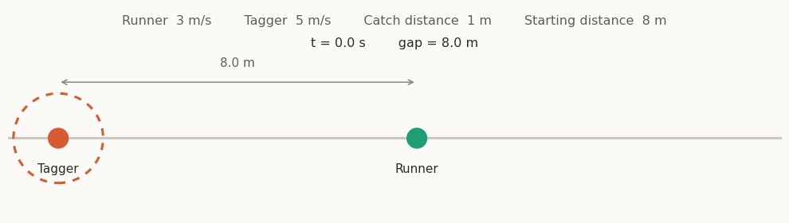

# Tag — play, self-handicapping, and predictive processing



*A tagger (orange) closing on a runner (green) in the agent-based model. [View the interactive version](https://htmlpreview.github.io/?https://github.com/AddiH/Tag_thesis/blob/main/ABM/chase-dynamics.html).*

## Introduction

This repository holds the code for Astrid E. Hansen's master's thesis in Cognitive Science (Aarhus University). The thesis asks whether self-handicapping, easing off to keep a game challenging, is what holds a game of tag together, and whether a simple change of goal, playing for fun versus playing to win, switches that behaviour on or off. The question is tested two ways: an agent-based model of tag and a field experiment with schoolchildren. This repository contains the model and the experiment's analysis code.

## Structure

```
├── ABM                          <- Agent-based model of tag
│   ├── ABM_output               <- Figures and CSVs produced by the model
│   ├── tag_abm.py               <- The model itself (agents, rules, chase dynamics)
│   ├── tag_abm_main.ipynb       <- Runs the parameter sweep, calibration, and figures
│   ├── tag_abm_ODD_report.md    <- ODD-protocol description of the model
│   ├── chase-dynamics.gif       <- Animation of a chase
│   └── chase-dynamics.html      <- Interactive chase visualisation
│
├── Experiment                   <- Field experiment with children
│   ├── code                     <- Data cleaning and H1 / H2 analysis
│   ├── html_output              <- Rendered analysis output
│   ├── plots                    <- Generated figures
│   └── run.sh                   <- Runs the analysis pipeline
│
├── .gitignore
├── LICENSE                      <- MIT (code)
├── requirements.txt             <- Python dependencies
└── setup_kernel.sh              <- Sets up the virtual environment and Jupyter kernel
```

Raw participant data is not included, for privacy reasons; the repository holds code, model outputs, and figures only.

## How to Run

1. **Set up the environment**
   ```sh
   bash setup_kernel.sh
   ```
2. **Run the model**: open `ABM/tag_abm_main.ipynb`, select the project kernel, and run it top to bottom.
3. **Run the experiment analysis**:
   ```sh
   cd Experiment
   bash run.sh
   ```

## AI Disclaimer

First drafts of the code in this repository were written with the assistance of Claude (Anthropic), and were subsequently reviewed, edited, and tested by the author.
